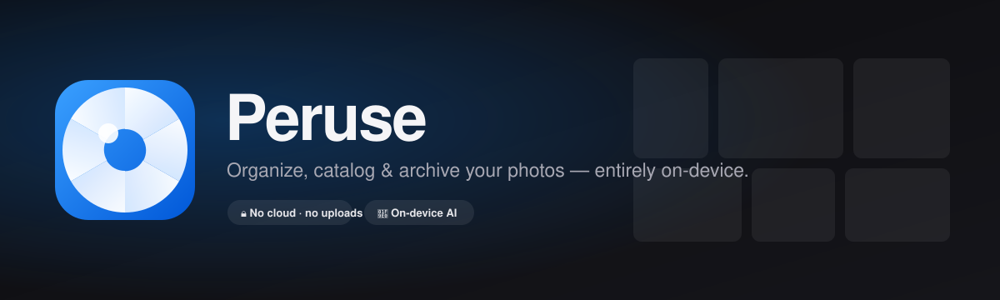

<div align="center">



<br/>

[](https://peruse.pages.dev/)
[](https://peruse.pages.dev/)
[](./LICENSE)

</div>

<br/>

<div align="center">

### 🔒 100% on-device &nbsp;•&nbsp; ☁️ zero uploads &nbsp;•&nbsp; ♾️ 100k+ photos &nbsp;•&nbsp; 🍎 Apple-style

</div>

<br/>

<table>
<tr>
<td width="50%" valign="top">

**📂 &nbsp;Any library, any format**
HEIC · HEIF · JPG · PNG · RAW. In-place, no copies. Screenshots flagged, video skipped, Live Photos kept.

**🌍 &nbsp;Exact locations**
Country from GPS by real border geometry — never guessed. No GPS → left blank.

**🧠 &nbsp;On-device AI**
Scene tags + natural-language search — _"sunset over a road"_.

</td>
<td width="50%" valign="top">

**⚡ &nbsp;Built for 100,000+**
Virtualized grid, lazy decoding, bounded memory. Seamless scrolling at any size.

**🧬 &nbsp;Deduplicate**
Perceptual-hash clustering → _keep the best shot_ in one click.

**💾 &nbsp;Secure backups**
Encrypted, compressed, metadata-only catalog snapshots. Thousands of photos → a few KB.

</td>
</tr>
</table>

<br/>

<div align="center">

|  |  |  |  |
|:--:|:--:|:--:|:--:|
| 🖼️ **Library** | 📅 **This Day** | 📱 **Devices** | 🗺️ **Places** |
| 🧬 **Duplicates** | ✨ **Themes** | ⚙️ **Settings** | 🔍 **Lightbox** |

</div>

<br/>

## Get Peruse

<div align="center">

**[▶︎ Open in browser](https://peruse.pages.dev/)** &nbsp;·&nbsp; **Install as an app** from the browser’s address bar (or Settings → Install)

<sub>Native macOS `.dmg` / Windows `.exe` builds are published on <a href="https://github.com/storitellah/peruse/releases">Releases</a> for each tagged version.</sub>

</div>

```bash
npm install && npm run dev      # web app
npm run tauri:build             # native installer (needs Rust)
```

<br/>

<div align="center">

🔐 [Security](./SECURITY.md) &nbsp;·&nbsp; 🏛️ [Architecture](./docs/ARCHITECTURE.md) &nbsp;·&nbsp; ✉️ [hello@storitellah.com](mailto:hello@storitellah.com)

<sub>Built by Storitellah · Your memories never leave your device.</sub>

</div>
